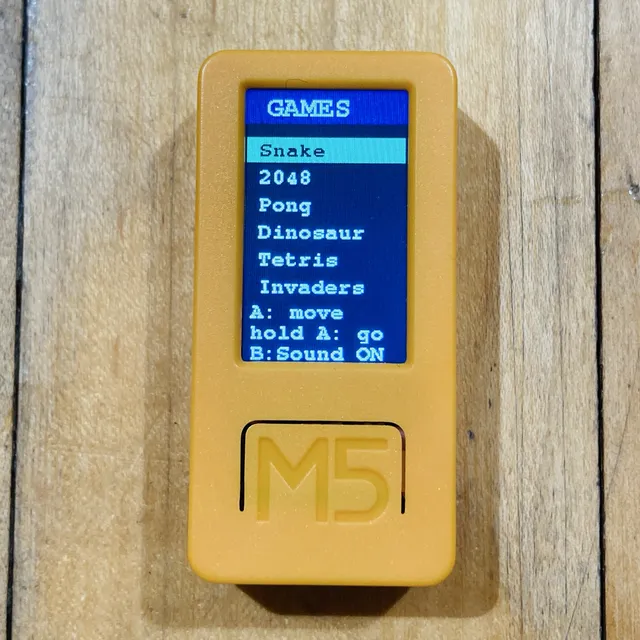
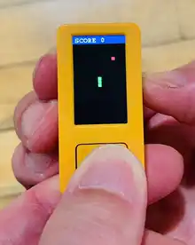
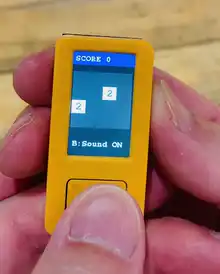
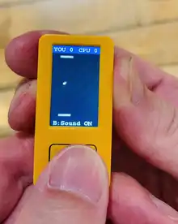
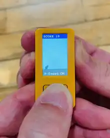
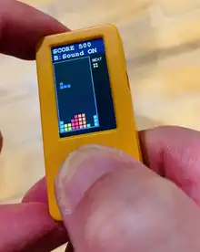
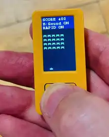

# tinygo-m5stick

[TinyGo](https://tinygo.org/) を [M5StickC Plus2](https://docs.m5stack.com/en/core/M5StickC%20PLUS2)（ESP32-PICO-V3-02）で動かすリポジトリ。環境構築〜ハードウェアのチュートリアルと、**レトロゲーム6本＋ランチャー**を収録。

📖 **ドキュメント**: https://kamitsui.github.io/tinygo-m5stick/

<p align="center">
  
</p>

## クイックスタート（macOS）

```bash
# 1. ツールチェーン（Homebrew）
brew tap tinygo-org/tools && brew install tinygo esptool

# 2. ランチャー（6ゲーム入り単一バイナリ）を書き込み
make flash PROJ=launcher
```

USB-C を下にして持つと表示が正立します。メニューは **A タップ=移動 / A 長押し=決定 / B=サウンド**。詳細は[はじめる](https://kamitsui.github.io/tinygo-m5stick/getting-started/)。

## レトロゲーム

| 画面 | ゲーム | 操作 | 単体で書き込み |
|---|---|---|---|
|  | **Snake** | A=左折 / B=右折 | `make flash PROJ=snake` |
|  | **2048** | チルトでスライド / A=リトライ / B=音 | `make flash PROJ=2048` |
|  | **Pong** | チルトでパドル / B=音（CPU対戦・先に5点）| `make flash PROJ=pong` |
|  | **Dinosaur** | A=ジャンプ / B=音 | `make flash PROJ=dinosaur` |
|  | **Tetris** | チルト移動・下=ドロップ / A=回転 / B=音 | `make flash PROJ=tetris` |
|  | **Invaders** | チルト移動 / A=発射(長押し連射) / B=音 | `make flash PROJ=invaders` |

各ゲームのタイトル/ゲームオーバーで **A 長押し＝ランチャーのメニューへ戻る**。設計の詳細は[ゲーム設計ドキュメント](https://kamitsui.github.io/tinygo-m5stick/games/)。

## ビルド・書き込み

`make` に集約（`tinygo` を直接叩かない）。`tinygo` / `esptool` は Homebrew 導入、PATH に `/opt/homebrew/bin` が必要。

```bash
make list                  # projects/ と cmd/ の一覧
make build PROJ=launcher    # ビルドのみ
make flash PROJ=tetris      # 実機へ書き込み（PORT は自動検出）
make docs-dev               # ドキュメントをローカルプレビュー
```

## リポジトリ構成

```
projects/    チュートリアル（01-blink … 05-m5lib-demo）
games/       各ゲームのロジック（ライブラリ package, Run(*Console,*IMU)）
cmd/<name>/  各ゲームの単体ビルド / cmd/launcher は6ゲーム入りランチャー
pkg/m5stickc 共通ハードウェア＋UIヘルパ（表示/Canvas/ボタン/ブザー/IMU）
docs/        VitePress ドキュメント（GitHub Pages 公開）
```

## ドキュメント

- [TinyGo とは](https://kamitsui.github.io/tinygo-m5stick/tinygo/)
- [はじめる（環境構築・書き込み）](https://kamitsui.github.io/tinygo-m5stick/getting-started/)
- [レトロゲーム設計（C4 / UML / 仕組み / 各実装）](https://kamitsui.github.io/tinygo-m5stick/games/)
- [技術ノート: ブザー音と非ブロッキング再生](https://kamitsui.github.io/tinygo-m5stick/notes/nonblocking-audio)

## 開発

- 進行は [Issues](https://github.com/kamitsui/tinygo-m5stick/issues) / マイルストーンで管理。
- ブランチ運用 + PR（squash）。コミットは英語の Conventional Commits。
- 詳細な規約は [CLAUDE.md](./CLAUDE.md)。

## ライセンス

[MIT License](./LICENSE) で公開しています。個人の学習・ショーケース目的のプロジェクトであり、**無保証**です（MIT の免責条項に従います）。

## 謝辞 / Third-party

本プロジェクトは以下を利用しています（いずれも寛容なライセンス）。

- [TinyGo](https://tinygo.org/) — BSD-3-Clause
- [tinygo.org/x/drivers](https://github.com/tinygo-org/drivers)（st7789 / mpu6886）— BSD-3-Clause
- [tinygo.org/x/tinyfont](https://github.com/tinygo-org/tinyfont) — BSD-3-Clause。同梱フォント（freemono / freesans 等）は **GNU FreeFont** 由来（プログラムへの埋め込み配布は許容）。
- [VitePress](https://vitepress.dev/) / [Mermaid](https://mermaid.js.org/) — MIT（ドキュメント生成）

M5StickC Plus2 は [M5Stack](https://m5stack.com/) の製品/商標です。
