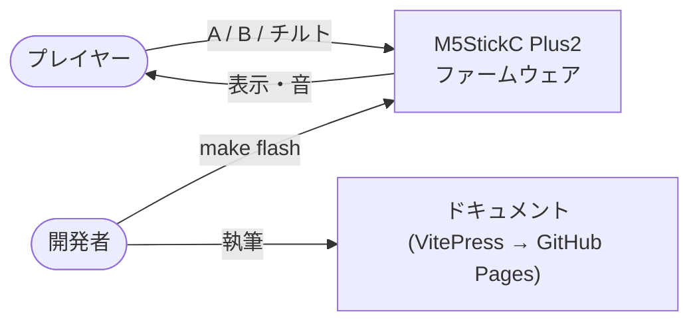
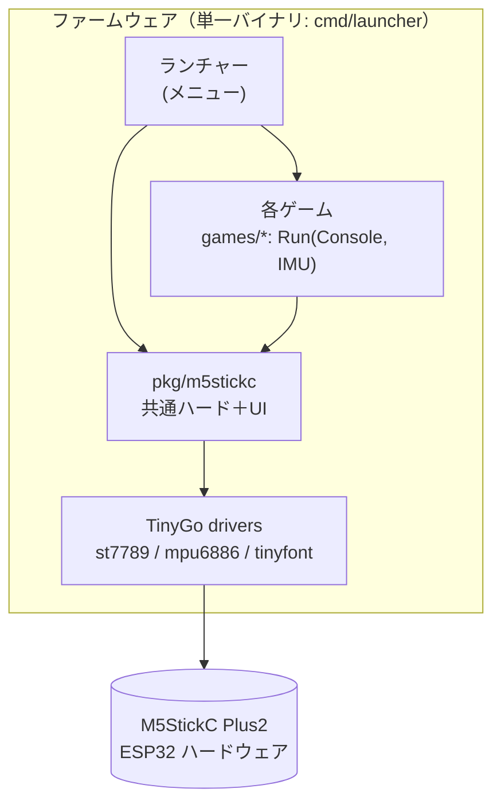
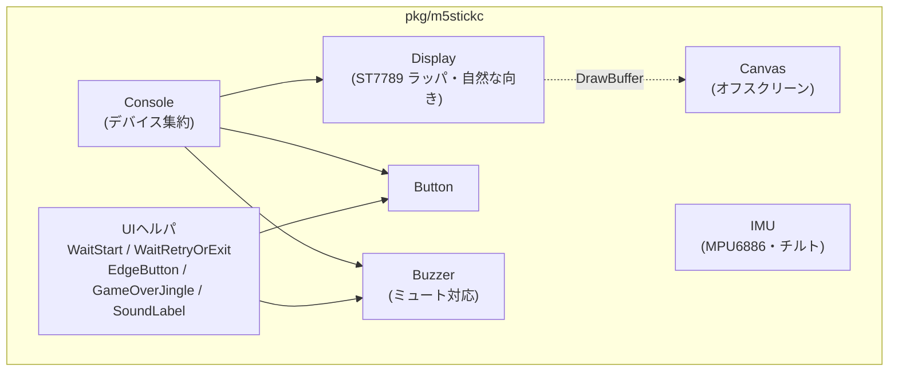
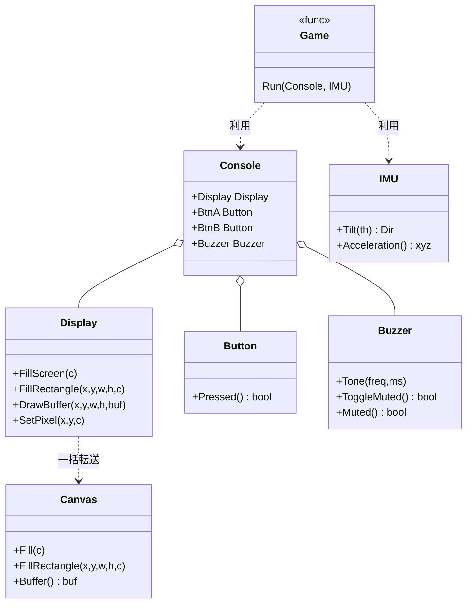
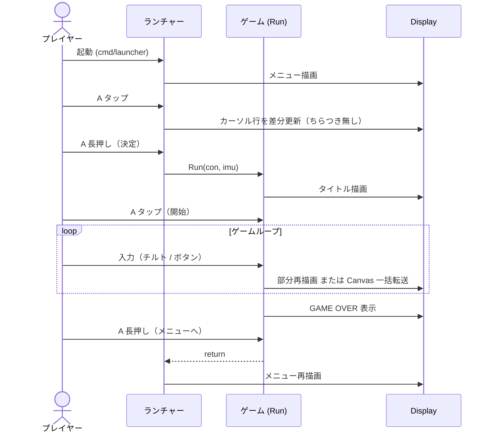

# アーキテクチャ（C4 / UML）

[C4 モデル](https://c4model.com/)の階層（コンテキスト→コンテナ→コンポーネント）と UML（クラス図・シーケンス図）で全体像を示す。

## C4: システムコンテキスト

誰が・何を使うか。

## C4: コンテナ

単一バイナリ（`cmd/launcher`）の中身と依存。

個別ビルド `cmd/<name>` も同じ `games/<name>.Run` を呼ぶ薄いラッパー。

## C4: コンポーネント（pkg/m5stickc）

共通パッケージの内部。

## UML: クラス図

主要な型と関係（Go なので「合成」が中心。継承は無い）。

## UML: シーケンス（起動→メニュー→ゲーム→復帰）

## パッケージ化の方針（まとめ）

- **薄いヘルパの合成**。各ゲームは自分のループ・描画を保持し、安定した重複だけを `pkg/m5stickc` に集約。
- **cmd レイアウト**で「個別ビルド」と「統合ランチャー」を両立。
- インターフェースは最小限（ランチャー→ゲームの `func(*Console, *IMU)`）。
- 詳しい背景は [概要・設計思想](./) を参照。
