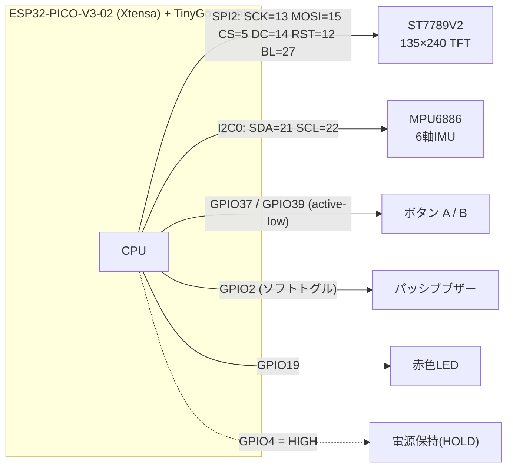
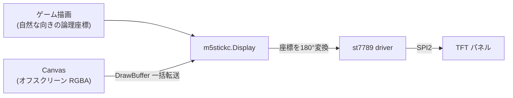

# ハードウェア / ソフトウェアの仕組み

M5StickC Plus2（**ESP32-PICO-V3-02 / Xtensa 系**）の周辺機器と、それを TinyGo から扱う仕組み。

## 接続ブロック図

専用 TinyGo ターゲットは無いため、汎用 `esp32-coreboard-v2` を使い、ピンはコードで指定する。

## 表示（ST7789V2）

ポイント:
- ドライバ(`st7789` v0.35.0)は **Rotation0 でオフセットを 0 にしてしまう**。1.14" パネルは GRAM 原点からずれているため、検証済みの **Rotation180 + ColumnOffset 53 / RowOffset 40** を使う。
- ただし Rotation180 のままだと上下逆さま。`m5stickc.Display` は**論理座標を 180° 反転して公開**し、**USB-C を下にした自然な向き**（左上原点・文字正立）で描けるようにしている。
- **ちらつき防止**: 盤面全体が動くゲーム（2048/Dinosaur）は、オフスクリーンの `Canvas` に描いて `DrawBuffer` で**一度に転送**。少数の物体だけ動くゲーム（Pong/Invaders 等）は**動いた部分だけ部分再描画**。
- 注意: `FillRectangle` は画面外（x+w>135 など）を無視するため、矩形は画面内に収める。

## 入力

| 入力 | 仕組み |
|---|---|
| ボタン A/B (GPIO37/39) | 入力専用ピンで内部プルアップ無し、基板側に外部プルアップ。押下=LOW を `Button.Pressed()` が反転して返す。`EdgeButton` で「押した瞬間」を検出 |
| チルト（傾け） | MPU6886 を I2C で読み、`IMU.Tilt()` が画面座標系（+X=右 / +Y=下）の方向を返す。**X 軸は表示の180°反転に合わせて符号補正**済み |

## サウンド

- **PWM(LEDC) は TinyGo の Xtensa ESP32 で未対応**。そのため周波数に合わせて **GPIO をソフトでトグル**して矩形波を作る（`tone` ドライバは PWM 前提のため使わない）。
- `Buzzer` は**ミュート状態**を保持し、ミュート中は `Tone` が即座に無音で返る（全ゲームの音 ON/OFF に利用）。
- 制約の詳細・非ブロッキング再生の可否は別途調査（[Issue #27](https://github.com/kamitsui/tinygo-m5stick/issues/27)）。

## 電源
- `HoldPower()` が GPIO4 を HIGH にし、バッテリ駆動時に電源が落ちないよう保持する（USB 給電時は不要だが害は無い）。
