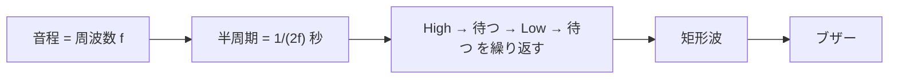
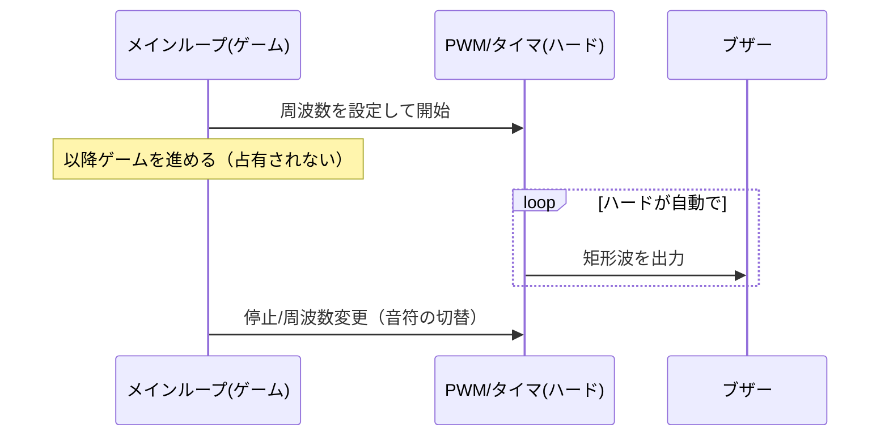
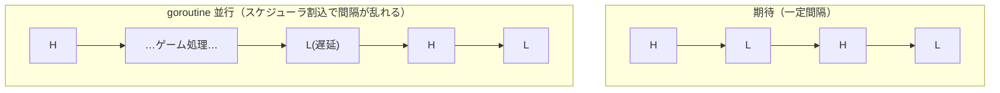

# 技術ノート: ブザー音と非ブロッキング再生

本プロジェクトのブザー音（特に Tetris の開始メロディ）は **ブロッキング**で鳴らしている。「鳴らしながらゲームを進める（BGM 的な非ブロッキング再生）」はなぜ難しいのか、どうすれば可能かを整理する（[Issue #27](https://github.com/kamitsui/tinygo-m5stick/issues/27)）。

## 1. 音が鳴る仕組み

パッシブブザーは、与えた**電気信号の周波数**で振動して音になる。一定周波数の**矩形波**（High/Low の繰り返し）を作れば、その周波数の音程（ピッチ）が鳴る。

本プロジェクトは PWM が使えないため、**CPU が GPIO(GPIO2) を周波数に合わせて手で High/Low トグル**して矩形波を作っている（`Buzzer.Tone`）。これは「鳴っている間ずっと CPU が張り付く」＝**ブロッキング**になる。

## 2. 本来の解: ハードウェアで波形を作る

CPU を占有せずに音を出すには、**波形生成をハードウェアに任せる**:

- **PWM (LEDC)**: 周波数とデューティ比をレジスタに設定すると、ハードが自動で矩形波を出し続ける。CPU は他の処理（ゲーム）を進められる＝**非ブロッキング**。
- **ハードウェアタイマ割り込み**: タイマが一定周期で割り込みを発生 → ISR(割り込みハンドラ)で GPIO をトグル。メインループはゲームを進め、音はタイマが鳴らす。
- **RMT / I2S**: 任意波形・音声データをハードが送出。

## 3. なぜ TinyGo × この ESP32 では難しいか

### PWM・割り込み・タイマが machine に無い
M5StickC Plus2 は **ESP32-PICO-V3-02（Xtensa 系 ESP32）**。TinyGo の `machine` パッケージ（`machine_esp32.go`）には、この系列向けの **PWM・GPIO 割り込み(`Pin.SetInterrupt`)・ハードウェアタイマの関数が無い**。つまり「ハードに波形生成を任せる」標準的な手段が**そのままでは使えない**。

- PWM(LEDC) のドライバは `machine_esp32xx_pwm.go` にあるが、ビルドタグは `esp32c3 || esp32s3` 限定（＝ Xtensa の無印 ESP32 は対象外）。
- 自前で LEDC レジスタやタイマ割り込みを叩く道は理論上あるが、`machine` の抽象の外で SVD レジスタ・割り込みベクタを直接扱う必要があり、難易度・リスクが高い。

### goroutine で並行にしても波形が崩れる
「別 goroutine でトグルし続ければ並行に鳴らせるのでは？」と考えがちだが、TinyGo の goroutine は**協調的スケジューラ**で動く（`time.Sleep` などで CPU を譲る）。ソフトトグルは **µs オーダーの精密なタイミング**が要るのに、トグルの合間にスケジューラがゲーム処理へ切り替わると、High/Low の間隔がずれて**音程が狂い、音質も劣化**する。割り込みのようなプリエンプション（強制中断）ではないため、安定した波形を別タスクと並行に出すのは困難。

## 4. 今のハード（M5StickC Plus2）で、他の技術スタックなら？

**可能**。同じ ESP32 でも、ESP-IDF / Arduino(ESP32) では:
- **LEDC(PWM)**: `ledcWriteTone()` 等で指定周波数の音を**ハードが鳴らし続ける**（CPU 非占有）。
- **RMT**: 任意波形をハードが送出（元は赤外線リモコン用だがトーン生成にも使える）。
- **I2S**: 音声データのストリーム再生。
- M5 公式の **M5Unified の `Speaker`** もこれらを利用している。

つまり制約は「**TinyGo の machine がこのチップでハード機能を公開していない**」ことに由来し、ハード自体は非ブロッキング再生の能力を持つ。

## 5. 他のハードウェアなら、TinyGo でも？

**可能**。TinyGo の **`machine.PWM` 対応ターゲット**なら、周波数を設定してデューティ50%にするだけでハードが鳴らし続ける＝非ブロッキング:
- **RP2040 / Raspberry Pi Pico**: `machine` の PWM を備える（[PWM チュートリアル](https://tinygo.org/docs/tutorials/pwm/)）。
- **ESP32-C3 / S3**（RISC-V 系）: `machine_esp32xx_pwm.go`（LEDC）で PWM 対応。

## まとめ

| 環境 | 非ブロッキング音声 | 手段 |
|---|---|---|
| **TinyGo × ESP32 Xtensa（本機）** | ✗（標準手段なし）| machine に PWM/割込/タイマ無し。自前レジスタ操作は高難度 |
| TinyGo × ESP32-C3/S3 | ○ | `machine` PWM(LEDC) |
| TinyGo × RP2040/Pico | ○ | `machine` PWM |
| ESP-IDF / Arduino × ESP32（本機）| ○ | LEDC `ledcWriteTone` / RMT / I2S |

**結論**: 本機（TinyGo × Xtensa ESP32）では、現状ブロッキング＋（再生中もミュート可）という割り切りが妥当。背景 BGM を本格対応するなら、(a) `machine` の外で LEDC/タイマ割り込みを自前実装する、(b) PWM 対応ハード（Pico / ESP32-C3/S3）に広げる、のいずれかになる。本リポジトリは将来 [他マイコン対応](https://github.com/kamitsui/tinygo-m5stick) を見据えているため、(b) の選択肢が現実的。

## 参考
- [TinyGo: Using PWM](https://tinygo.org/docs/tutorials/pwm/)
- [TinyGo: Raspberry Pi Pico (machine)](https://tinygo.org/docs/reference/microcontrollers/machine/pico/)
- [ESP-IDF: LED Control (LEDC)](https://docs.espressif.com/projects/esp-idf/en/latest/esp32/api-reference/peripherals/ledc.html)
- [Arduino-ESP32: LEDC](https://docs.espressif.com/projects/arduino-esp32/en/latest/api/ledc.html)
